# CSE 8B & CSE 11: Common Issues
A list of common issues students in CSE 8B/11 are encountering and how to fix them. 

## Table of Contents
- [CSE 8B & CSE 11: Common Issues](#cse-8b-cse-11-common-issues)
   * [Table of Contents](#table-of-contents)
   * [General Logistics](#general-logistics)
   * [(Run Script) Misc: "A terminally deprecated method in java.lang.System has been called"](#run-script-misc-a-terminally-deprecated-method-in-javalangsystem-has-been-called)
   * [(Run Script) Problem: "The XXXXX class could not be found."](#run-script-problem-the-xxxxx-class-could-not-be-found)
   * [(Run Script) Problem: "The XXXXX class could not be instantiated. ](#run-script-problem-the-xxxxx-class-could-not-be-instantiated)
   * [(Run Script) Problem: ./run Not Found](#run-script-problem-run-not-found)
   * [(Gradescope) Problem: Gradescope is Complaining](#gradescope-problem-gradescope-is-complaining)
   * [(VSCode) Problem: "The import tester cannot be resolved"](#vscode-problem-the-import-tester-cannot-be-resolved)
   * [(In Terminal) Error: error: package tester does not exist](#in-terminal-error-error-package-tester-does-not-exist)
   * [(VSCode) Misc: Unused "import tester.*" Line](#vscode-misc-unused-import-tester-line)


## General Logistics

<details>
<summary>Download Entire Starter Code</summary>
<br> 

Please make sure you download the entire starter code. Do **not** copy and paste a subset of the files, or else you may not have everything you need to complete this PA.

Keep in mind that, when you download the starter code from the GitHub repository, the files will be downloaded in a ZIP (compressed) file. You _must_ unzip the files before you can work with them; attempting to edit files directly from a ZIP (compressed) file will cause problems. 
- To unzip a file on Windows, refer to [this guide](https://support.microsoft.com/en-us/windows/zip-and-unzip-files-8d28fa72-f2f9-712f-67df-f80cf89fd4e5). 
- To unzip a file on Mac, refer to [this guide](https://support.apple.com/guide/mac-help/zip-and-unzip-files-and-folders-on-mac-mchlp2528/mac). 

We strongly recommend putting your starter code in a dedicated folder where you can easily find it. For example, a "CSE8B" or "CSE11" folder that contains a "PA1" folder, "PA2" folder, and so on, with each PA folder containing your code for that programming assignment.

---

</details>


<details>
<summary>Saving Your Code</summary>
<br> 

Make sure you **save** your file before using the `run` command. On Visual Studio Code (VSCode), you can tell if a file is _not_ saved if you see a white dot next to the file name.

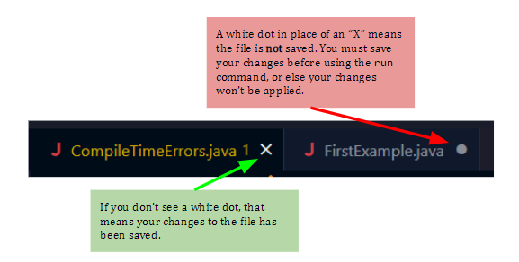

If you want, feel free to enable autosave on VSCode; the instructions for that can be found [here](https://code.visualstudio.com/docs/editor/codebasics#_save-auto-save).

---

</details>


<details>
<summary>Code Formatting</summary>
<br> 

Please make sure your code is readable. If you have the [Java extension pack for VSCode](https://marketplace.visualstudio.com/items?itemName=vscjava.vscode-java-pack), then VSCode has the ability to automatically format your code. 

To format your code using the extension, right-click anywhere in your code and click on "Format Document."

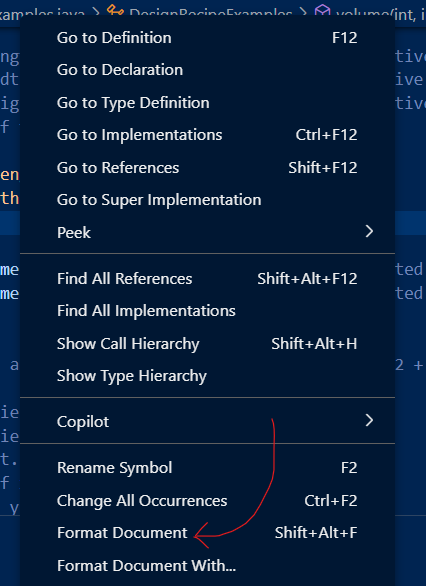

Style guidelines from past iterations of this course can be found [here](https://cseweb.ucsd.edu/classes/sp23/cse8B-a/styleguide.html); the most relevant parts of this guide is everything starting from the "Proper Indentation" section and below. 

> [!WARNING]
> While style is **not** part of your grade, tutors and TAs reserve the right to not help you with your code if they cannot understand your code due to formatting issues.

---

</details>


## (Run Script) Misc: "A terminally deprecated method in java.lang.System has been called"

After using the `run` command, you might have noticed a warning that looks something like:
```
WARNING: A terminally deprecated method in java.lang.System has been called
WARNING: System::setSecurityManager has been called by tester.Main (file:.../cse11-pa1-starter-main/lib/tester.jar)
WARNING: Please consider reporting this to the maintainers of tester.Main
WARNING: System::setSecurityManager will be removed in a future release
```

you can ignore this as well.

**In general**, you can ignore any warnings that you may get, _as long_ as you're getting the expected output.


## (Run Script) Problem: "The XXXXX class could not be found."

```
$ ./run FirstExample
Exception in thread "main" java.lang.RuntimeException: The FirstExample class could not be found.
Please make sure to specify the name of your examples class properly (with no typos).
```

<details>
<summary>Check: Does the Class Exist?</summary>
<br> 

Keep in mind that the `run` script takes in the name of the **class** to run, not the name of the file.

So, you must provide the name of a valid class in your current directory (wherever the `run` script is located).

For example, let's suppose you have the file `Hello.java` which contains the following code:

```java
class A {
    int x = 10;
}

class B {
    int y = 15;
}

class C {
    int d = 20;
}
```

Then, `./run A`, `./run B`, and `./run C` will work just fine, but you'll get the error for `./run Hello`. 

---

</details>

<details>
<summary>Check: Are You in Wrong Directory?</summary>
<br> 

It's also possible that you are running the `run` script from the wrong directory. In this case, make sure you are working in the directory that contains the file with the code you want to run. 

---

</details>

<!-- =================== -->

<details>
<summary>Check: Do You Have Code That Doesn't Compile?</summary>
<br> 

If there's any code in your current directory that doesn't compile (even if it's code that isn't at all related to the class you're trying to run), then you need to fix those errors or comment those errors out.

One easy way to comment out code is to use the multiline comment, which looks something like

```java
/*
everything between
the first slash star and 
the following star slash
will not be executed
*/

int butThisWillCompile = 10;
```

Due to a limitation with the way the `run` script works, any Java code that has a compile-time error will result in the `run` script not working.

---

</details>

<!-- =================== -->

<details>
<summary>Check: Did You Save It?</summary>
<br> 

If the above solutions do not work, please make sure you **saved** your file.

---

</details>


## (Run Script) Problem: "The XXXXX class could not be instantiated. 
If you're getting an error that looks like
```
Exception in thread "main" java.lang.RuntimeException: The ExampleVideos class could not be instantiated.
```


<details>
<summary>Check: Constructor</summary>
<br> 

Make sure the class you're trying to run does _not_ have a constructor with one or more parameters. 

The error message should also include that hint, e.g.,

```
Please make sure that your examples class has a default constructor (with no arguments) that does not fail during instantiation.
```

---

</details>


<details>
<summary>Check: Possible Errors in Constructor</summary>
<br> 

If you're performing any operations in the constructor that could possibly result in an exception being thrown, ensure the exception _never_ occurs (e.g., add additional logic to your constructor to prevent any exceptions or, as a quick fix, you can use `try`/`catch`).

The error message should also include that hint, e.g.,

```
Please make sure that your examples class has a default constructor (with no arguments) that does not fail during instantiation.
```

---

</details>


<details>
<summary>Check: Class Name Case Sensitivity</summary>
<br> 

If your error message does not include any additional helpful information, e.g., you're getting something like

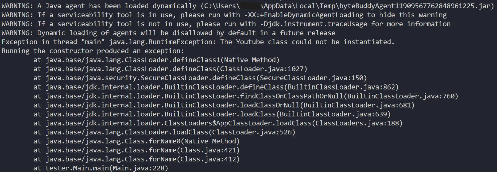

Then, check the class name that you're providing after the `run` command. In particular, when you're using the `run` command, make sure what you're putting into the `run` command has the same case sensitivity and spelling as the class definition. 


For example, if you have the class, 

```java
class HelloWorld {
    // ...
}
```

Then, you must run the command as `./run HelloWorld`. 

You will get the error if you pass in a class name with the correct spelling but incorrect case sensitivity, e.g.,
- `./run Helloworld`
- `./run HELLOWORLD`
- `./run helloworld`

---

</details>


## (Run Script) Problem: ./run Not Found
If you're getting an error that states that the `run` file is not found or is not recognized, e.g.,
- `./run : The term './run' is not recognized as the name of a cmdlet, function, script file, or operable program.`
- `-bash: ./run: No such file or directory`

You'll need to make sure your terminal is in the correct directory.

<details>
<summary>Solution (VSCode): Nested Directories</summary>
<br> 

One common issue we've seen involves when a student have an explorer view that looks similar to the following:

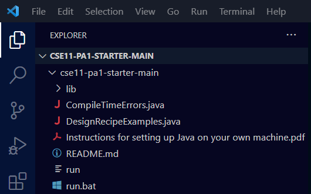

This situation generally occurs when you unzip the contents of a folder, so you end up with a folder whose content is another folder, where that folder's contents is the actual PA code. In this example, notice how we have **two** `cse11-pa1-starter-main`; this means that you've opened the `cse11-pa1-starter-main` folder that _contains_ another `cse11-pa1-starter-main` folder. 

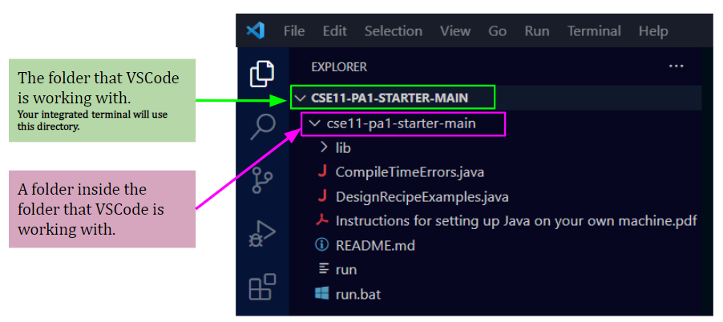

In this case, make sure you open the _inner_ folder (click on `File` at the top-left corner of VSCode and then click on `Open Folder...`). That way, when you open VSCode's terminal, it'll automatically default to using the inner folder, which has all the starter code files. 

---

</details>


<details>
<summary>Solution (VSCode Terminal): Change VSCode Directory</summary>
<br> 

**If you're using the VSCode/integrated terminal in Visual Studio Code**, make sure you've opened the correct directory. To open a directory for editing, (1) click on `File` at the top-left corner of VSCode and then (2) click `Open Folder...`. 

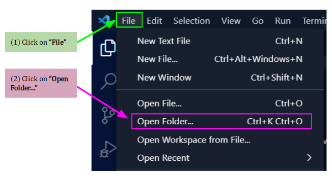

From there, select the correct folder -- this is the folder that contains the starter code. Once you open the folder in VSCode, when you open a new instance of the terminal, the terminal should automatically be set in the folder containing your starter code. 

---

</details>


<details>
<summary>Solution (VSCode Terminal): Open Folder in Integrated Terminal</summary>
<br> 

The other option you can do is to open the folder directly in the integrated terminal. To do so,
1. In the explorer view, find the folder containing the code you want to run. For example, let's suppose I want to open the `cse11-pa1-starter-main` folder, which contains the code I want to run.

    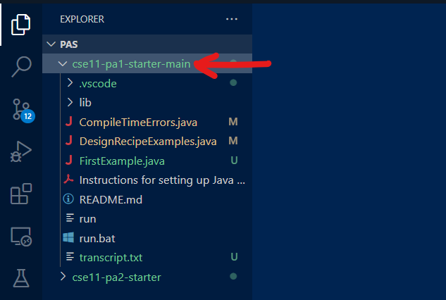

2. Next, right-click on the folder in question so that a menu shows up. Select the "Open in Integrated Terminal" option.

    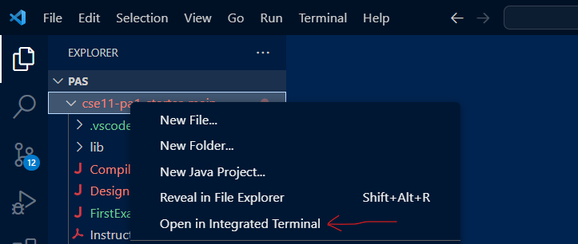

3. A terminal that's in the correct directory should now show up.

---

</details>


<details>
<summary>Solution (External Terminal): Use Command Line</summary>
<br> 

If you're using a separate terminal (i.e., a terminal that isn't associated with VSCode or your editor of choice), then you can use the command line to navigate your terminal to the correct directory.

Use the command **`ls`** (or **`dir`** if using Windows Command Prompt) to see what files and folders are in your terminal's current directory. Chances are, you won't see the `run` file. You also want to use the **`cd <folder>`** command to make your terminal switch to the **`<folder>`** directory. See [this guide](https://tutorials.codebar.io/command-line/introduction/tutorial.html) for more information regarding `cd` and `ls`.

To see how you can use these commands to navigate to the right directory:
- running **`cd Desktop`** will make the terminal go into the `Desktop` directory, if the `Desktop` folder is in your terminal's current location. If `Desktop` is not in your terminal's current location, then an error will be shown. 

    To get an idea of what this process might look like, take a look at the following screenshot where I keep switching directories and checking what files and folders are in the directory until I find the starter code:

    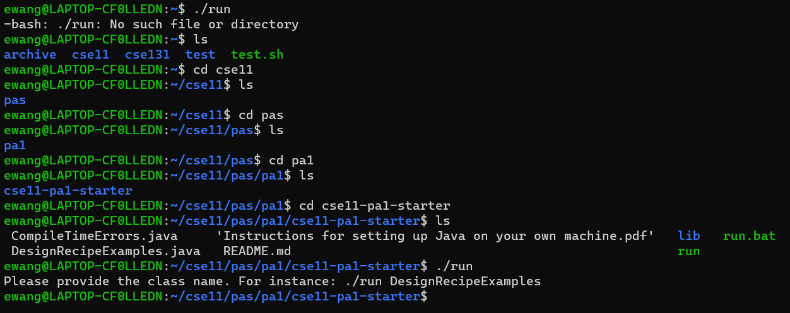

- running **`cd C:\Users\ewang\Desktop\PAs\cse11-pa1-starter-main`** will make the terminal go **directly** to the _inner_ `cse11-pa1-starter-main` directory in your Desktop folder, if it exists.

    To get an idea of what this process might look like, take a look at the following screenshot where I switch directly to the directory that contains the starter code:

    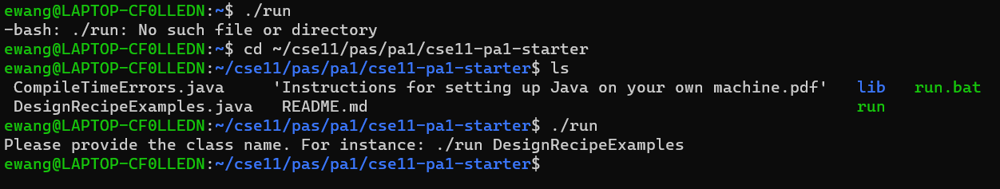


---

</details>


## (Gradescope) Problem: Gradescope is Complaining

If Gradescope is able to find all your files, but gives you an error, there are a few possible reasons why. **Carefully read the error messages that Gradescope prints out.** This will give you an idea of what might have happened.

Some examples of common errors are discussed below.

<details>
<summary>Error: cannot find symbol</summary>
<br> 

There are several reasons why you might be getting this error:
- Your classes and methods must be spelled out exactly as specified in the instructions. Class and method names are case sensitive. 

    For example, if the instructions state that you need to 
    > Develop a method named `volume`...

    you must create a method with the name being _exactly_ `volume`; naming the method anything other than `volume` (e.g., `Volume`, `volum`, `vol`) will result in an error from Gradescope.

    This is by far one of the most common errors we've seen.

- Your class is inside another class. For all PAs in this course, your classes should not be contained in another class.

    For example, the following code will generate this error message because the `User` class is inside the `ExampleVideos` class.

    ```java
    class ExampleVideos {
        class User {
            // ...
        }
    }
    ```


---

</details>

<details>
<summary>Error: method (name) in class (class) cannot be applied to given types</summary>
<br> 

If Gradescope says something like "error: method (name) in class (class) cannot be applied to given types" and then points to a method call, this means your method does not have the parameters that we required.

For example, if we ask you to create a method named `something` with 3 integer arguments that returns an integer, we expect something like
```
int something(int a, int b, int c) {
    ...
}
```

An example of a method implementation that will cause Gradescope to throw an error is
```
int something(int a, int b) {
    ...
}
```


Example Gradescope Error Messages:
```
Grade.java:215: error: method volume in class DesignRecipeExamples cannot be applied to given types;
            double score_test_1 = report_Score(3, Math.abs(dre_s.volume(2,2,2)), 8);
                                                                ^
```

---

</details>


<details>
<summary>Error: The autograder failed to execute correctly.</summary>
<br> 

If you're getting this error, one possible reason is that you have print statements in your code when we didn't ask you to print anything whatsoever. If this is the case:
- While you are allowed to use print statements to help debug your code, keep in mind that it will break the autograder if you leave it there. 
- You'll need to either remove any print statements, or comment them out, prior to submission.

Something else to consider: if you've been using the `main` method, when the programming assignment didn't tell you to use a `main` method, then you should not use the `main` method. Use the `run` script to run your code.

---

</details>


## (VSCode) Problem: "The import tester cannot be resolved"

If you see `The import tester cannot be resolved` in your VSCode's Problems tab, e.g.,

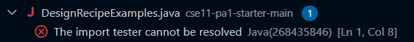

please ignore it. As long as the `lib` folder contains `tester.jar`, you'll be fine. 

<details>
<summary>Alternative Fix: Tell VSCode to Recognize It</summary>
<br> 

You can tell VSCode to recognize the `tester` import by following these steps:

1. In the explorer view, there should be a "Java Projects" section. Under the "Java Projects" section, there should be a "Referenced Libraries" subsection. Hover over that subsection and then press the "+"

    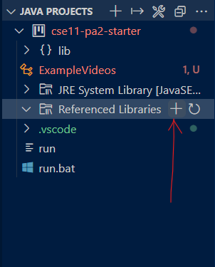

2. Next, look for the `tester.jar` file (it should be in a `lib` folder if you're working on the programming assignment). Select the JAR file and then press "Select Jar Libraries.

    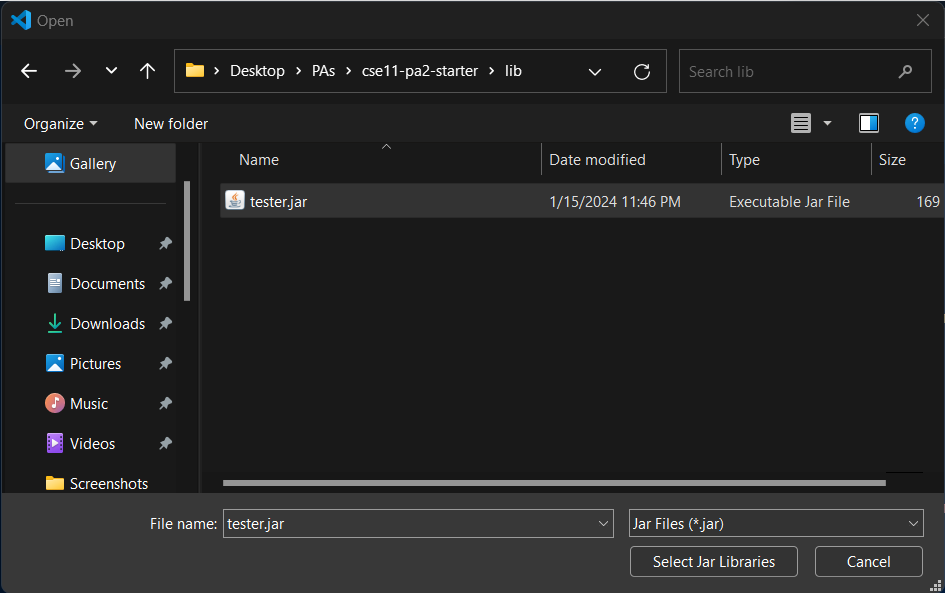

3. VSCode should now recognize the `tester` import.

---

</details>

## (In Terminal) Error: error: package tester does not exist
If you're getting an error similar to this one:
```
ExampleVideos.java:1: error: package tester does not exist
import tester.*;
^
1 error
```

<details>
<summary>Check: Using Run Script</summary>
<br> 

Make sure you're using the `run` script that came with the programming assignment. You may be getting this error if you're using `javac`. 

> [!NOTE]
> If the assignment requires you to use `javac`, then you can also remove the `import tester.*` line.

---

</details>

<details>
<summary>Check: tester.jar Exists</summary>
<br> 

Make sure there's a `lib` folder in the directory your terminal is in, and further make sure there's a `tester.jar` file in the `lib` folder.

If you have a `tester.jar` file in your current directory, but there's no `lib` folder, create a `lib` folder and put the `tester.jar` file in the `lib` folder. 

If this is not the case, you probably need to download the starter code again.

---

</details>

## (VSCode) Misc: Unused "import tester.*" Line

Don't worry about it.